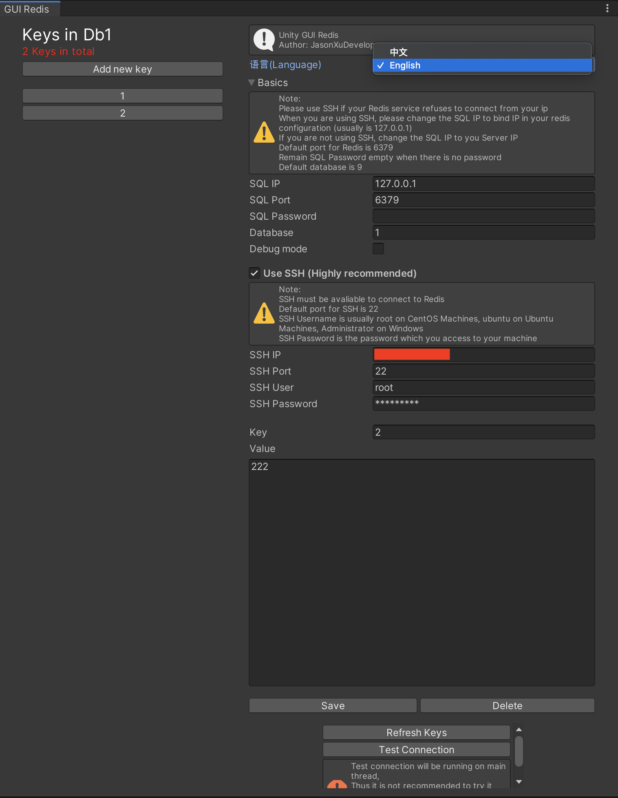
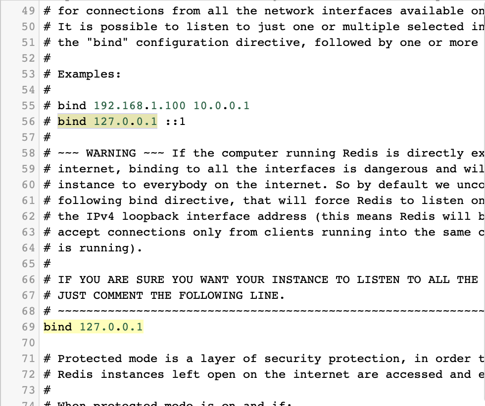
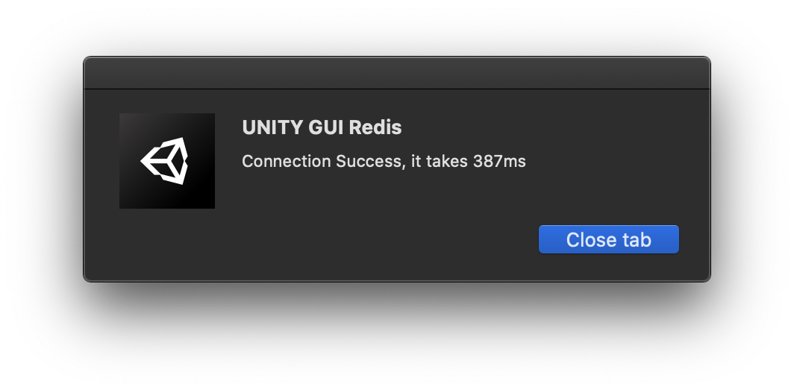
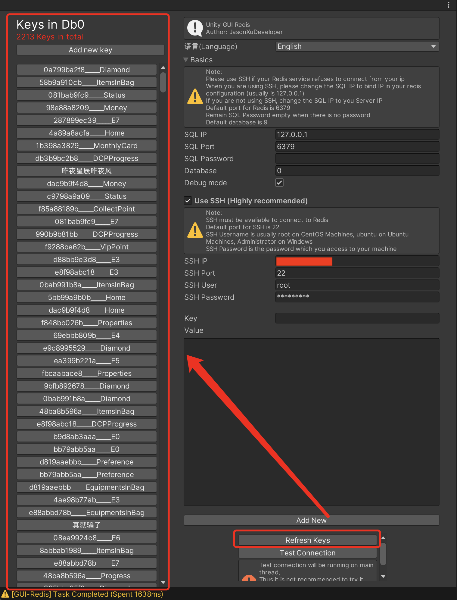

# GUI Redis

An Unity Plugin which enhances productivity for developers who are using Redis.
[中文请点这里](#中文说明)

### Features

----

- Connect to Redis Server Directly
- Connect to Redis Server through SSH Tunel (Safer way)
- Add new values
- Get existing values
- Edit values
- Delete values
- Changing databases (ie. change to db0, db1,etc)
- **Not running on MAIN THREAD**, which means it **will not inpact** the performance while you are running your game on Unity Editor

> Note that GUI Redis is only supported modifying key-value pairs data in Redis in current version.
>
> Which means: Hash, List, Set, Zset, etc. is not avaliable right now.


### Quick Start

---

1. <a href="GUI Redis.unitypackage" target="_blank">Download the unity package here.</a>

2. Import the package to your Unity Project.

3. When unity finishes processing the new dll, click on JEngine/GUI Redis on the menu.

   

4. A window should pop up with Chinese, if you can't read Chinese, don't worry, go to Language and choose English, so that you will be able to understand all the features.

   

5. Go to your server and check your config of Redis, go to the part with bind.

   

   > Note that if you don't want to connect Redis via SSH, comment bind part and change protected-mode on config to no
   >
   > 

6. Now, go back to Unity, and GUI Redis window.

7. If it says 127.0.0.1, and it is **NOT COMMENTED**, keep **SQL IP** part to **127.0.0.1**, change **SQL Port** to your port which also tells in the config (*usually it is port **6379***), change  **SQL Password** to your password, keep it empty if you don't have a password, last but not least, change **Database** to **0**, which is the first database of Redis.

8. If it **does not contains any piece of code** which says **bind** or they are **all commented**, it means Redis can be connected from public ip, but for security reasons, please set a password for your Redis. Go back to Unity, kinda similar to step 7, but change **SQL IP** to your **Server IP** instead of 127.0.0.1, and change the port, password, and database.

9. Press Test Connection.

   > Note that test connection will be running of main thread of Unity, which might make Unity unresponding but it is actually running.

   

10. As usual, Unity will pop up a dialog which tells you whether successfully connected or not, if not, please check the console which will give you the error message

    > Usually there are these types of errors:
    >
    > - Redis connection refused (Happens when you are not using SSH and you did not change your Redis configuration which can accept connections from public ip, you can try whether **Use SSH Connection** or **Comment binding parts on your Redis and change protected-mode to no**)
    > - Unable to connect to SSH: Permission denied (Happens when wrong SSH password)

11. Congratulation! **You can now use the plugin!**

12. Click on **Refresh Keys**, and all keys in database will pop up

    

13. Now, you can whether add new data into your database, or modify any data in the list.

    

### Why Use GUI Redis

---

Just like the intro, **GUI Redis** enhanced the performance while game developing, developers are able to modify their data when they debugging the game, which means efficiency has been enhanced.

As we all know, Unity has its main thread which runs *every Unity things*, if some piece of code pauses the thread, the whole Unity Editor will become not responding, but in GUI Redis, a sub-thread has been used which has no impact to the main thread, this means: **Show no fears, show no mercy to bugs, don't be afraid that bugs in GUI Redis will crash the game!**


### What will come up next

___

- Brand New Debugging System (Not using Debug.Log anymore, logs will not show in Unity Editor Console any longer, a new Console will be invented)
- Optimized algorithm which boost up the speed to connect to Redis
- SSL connection to Redis
- SSH with signed-file to connect to server


### Direcory Structure

___

```
├── Demo                        // Unity Demo
├── Docs                        // Images and videos for README.md
├── Source Code                 // Source code for plugin
├── README.md										// Markdown file
├── GUI Redis.unitypackage			// Unity Plugin Package
```


### Depencies

___

> Note all depencies GUI Redis used is open-sourced

- [Renci.SshNet](https://github.com/sshnet/SSH.NET)
- [ServiceStack.Redis](https://github.com/ServiceStack/ServiceStack.Redis)


### Development Environment

___

- Debuging Unity Engine Version: 2019.3.13f1
- .net Environment: .net 4.6
- Operating System: MacOS 10.15.5


### DEMO Video

___

<video>
   <source id="mp4" src="Docs/Demo.mp4" type="video/mp4">
</video>


### Issues

___

If you have any issues,

- Please follow [jason_the_developer](https://www.instagram.com/jason_the_programmer/) at instagram and send me messages
- Or, submit new issue on github page

# 中文说明

一个可以提高使用Redis数据库开发游戏的效率的Unity插件

### 功能

----

- 直连Redis数据库
- 通过SSH连接Redis数据库（更安全）
- 新增数据
- 获取数据
- 修改数据
- 删除数据
- 切换数据库（如切换Db0，Db1之类）
- **插件并不运行在主线程**, 这代表了插件**不会影响**游戏在Unity编辑器运行的性能

> 特需注意，GUI Redis目前版本仅支持操作Redis数据库最基础的数据类型（键对值类型）
>
> 这表明了，哈希表，队列，有序队列这些功能暂时还无法使用


### 快速上手

---

1. <a href="GUI Redis.unitypackage" target="_blank">从这里下载Unity插件包</a>

2. 将插件包导入Unity

3. 当Unity加载好新的Dll，点击顶部菜单栏中JEngine/GUI Redis

   

4. 点击后，会弹出一个窗口

   

5. 在使用插件之前，请登入服务器，查看Redis的配置文件中含有bind的部分

   

   > 注意：如果你不想通过SSH连接数据库，那么bind需要被注释掉，protected-mode必须为no
   >
   > 

6. 回到Unity的GUI Redis窗口

7. 如果Redis配置中bind的地址为127.0.0.1，并且**没有注释**, 将面板中**SQL IP**改为**127.0.0.1**, 将面板**SQL Port**改成你数据库的端口 (通常是**6379***)，配置**SQL Password**为Redis数据库密码，如果无密码就留空， 最后，将**Database**设置为**0**，即第一个数据库

8. 如果**没有代码bind了地址**这代表你可以使用公共IP访问数据库，但这样子安全性隐患很大，建议设置一个密码
   如图第7部，唯一的不同是将**SQL IP**改为**服务器IP**而非127.0.0.1

9. 点击测试连接

   > 需要注意的是，测试连接将运行在Unity主线程，如果连接的慢，会导致Unity无响应，这是正常的

   

10. 如图所见，Unity会出现一个弹窗告知你连接状态，如果连接失败，请在控制台查看错误原因

    > 通常有这些错误：
    >
    > - Redis connection refused (通常发生于Redis拒绝公共IP访问，可以尝试**通过SSH连接**或**注释Redis配置中bind部分并将protected_mode改为false（不推荐这么做，很不安全）**)
    > - Unable to connect to SSH: Permission denied (发生于SSH密码错误)

11. 恭喜！**你可以尽情使用插件了**

12. 点击**刷新Keys**，该数据库中全部Keys会出现在左侧

    

13. 现在，你可以在Unity中对你的Redis数据库进行增删改查了！

    

### 为什么使用GUI Redis

---

如图介绍所言，**GUI Redis**大幅度提高了针对使用Redis作为数据库的游戏项目的开发效率，开发者可以在游戏运行的同时，操作可视化数据，并不需要在远程连接服务器，或下载其他软件来操作数据。

并且，我们知道，Unity的程序全部运行在其主线程，如果有哪里的代码出错了，会导致主线程崩溃，而使用GUI Redis，对于Redis数据库的操作全部运行在子线程，因此，你**无需恐惧bug，不要对bug仁慈，该插件任何的bug不会影响到你任何的代码**，所以，如果你的游戏项目使用了Redis作为数据库，有什么理由不去试试这个插件呢？


### 接下来会实现什么

___

- 全新的控制台（不再使用Unity自带的控制台）
- 优化算法，提高Redis速度
- SSL连接Redis
- 通过签名文件连接SSH


### 目录结构

___

```
├── Demo                        // Unity 演示
├── Docs                        // markdown文件引用的图片和视频
├── Source Code                 // 插件源码
├── README.md										// Markdown文件
├── GUI Redis.unitypackage			// Unity插件包
```


### 依赖项

___

> 注意，GUI Redis使用的全部依赖性都是开源的

- [Renci.SshNet](https://github.com/sshnet/SSH.NET)
- [ServiceStack.Redis](https://github.com/ServiceStack/ServiceStack.Redis)


### 开发环境

___

- 测试Unity版本：2019.3.13f1
- .net环境：.net 4.6
- 操作系统： MacOS 10.15.5


### 演示视频

___

<video>
   <source id="mp4" src="Docs/Demo.mp4" type="video/mp4">
</video>


### 问题反馈

___

有问题请：

- 加作者QQ：2313551611
  并标明是从Github来反馈问题的！
- 或在Github提交issues！
